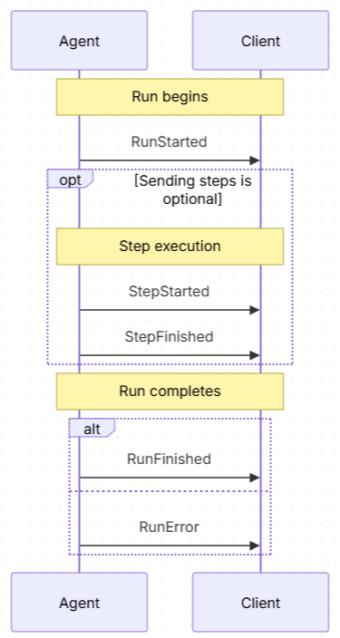
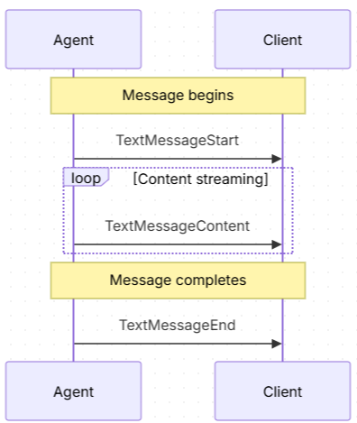
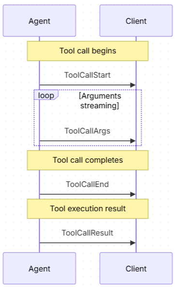
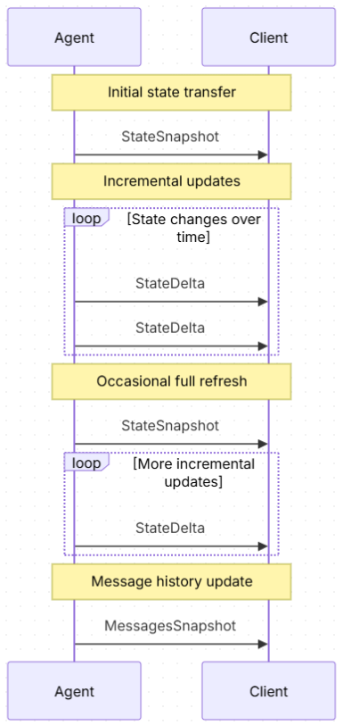
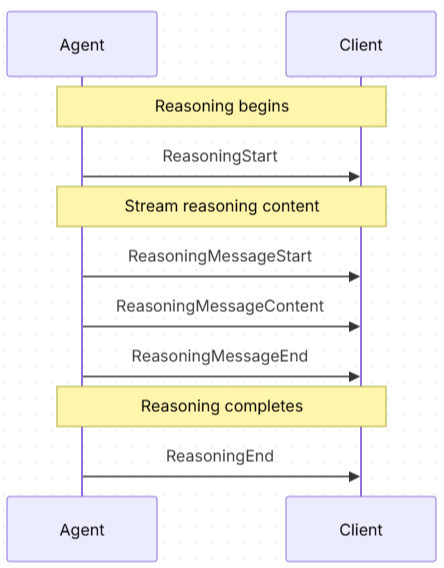

# AG-UI

AG-UI è un protocollo che consente di costruire applicazioni agenti AI basate sul web con funzionalità avanzate come streaming in tempo reale, gestione dello stato e componenti interattivi dell'UI.  
L'interfaccia visualizzata all'utente viene controllata dal server ed inviata in tempo reale al client tramite SSE (Server Side Events) via HTTP/HTTPS o webSocket.

## Struttura del protocollo
Il protocollo usa tre endpoint:
- uno per inviare la richiesta iniziale al server (per es.: `agent/run`)
- uno per inviare al client gli eventi generati dal server (per es.: `agent/events`)
- uno per ricevere dal client le richieste dell'utente (per es.: `agent/event`)

Il server genera gli eventi come oggetti JSON e li invia al client tramite SSE. Il framework AG-UI è principalmente un framework di FrontEnd, per cui include componenti per ricevere e visualizzare i dati ricevuti dal server.

Se il server web fosse in grado di ricevere una richiesta in POST e convertirla in SSE, si potrebbe usare un unico endpoint.

## Flusso del protocollo
La richiesta iniziale viene inviata al primo endpoint, mentre tutta la conversazione si svolge sull'endpoint per gli eventi.  
In dettaglio l'interazione si svolge così:
1. Il client si connette in GET tramite un client SSE all'endpoint degli eventi (per es.: `agent/events`)
2. Il client invia la prima richiesta in POST all'endpoint dell'agente, ma non si aspetta di ricevere risposte (per es.: `agent/run`)
3. Il server riceve la richiesta, prepara la risposta, però, invece di inviarla al client, deve "pubblicarla" sull'endpoint per gli eventi.  
Un modo per farlo è di configurare sull'endpoint degli eventi un event loop che monitorizza gli eventi generati e, una volta intercettato un evento, lo converte in JSON, crea una stringa con questo formato "data: {JSON}\n\n" e lo invia al client come evento SSE usando il content type `text/event-stream`
4. Il client riceve l'evento e mostra l'interfaccia all'utente, eventualmente usando i componenti forniti dal framework AG-UI
5. Le interazioni dell'utente con l'interfaccia (opzione selezionata, modulo compilato, ecc.) vengono inviate all'endpoint per la ricezione delle richieste (per es.: `agent/event`) senza aspettarsi una risposta
6. Il server riceve la richiesta, la elabora, e pubblica la risposta sempre sull'endpoint degli eventi

## Tipi di eventi
Gli eventi ricevuti sono di diversi tipi:  
| Categoria | Descrizione |
| --- | --- |
| Lifecycle Events | Monitorano la progressione delle esecuzioni dell’agente |
| Text Message Events | Gestiscono contenuti testuali in streaming |
| Tool Call Events | Gestiscono l’esecuzione degli strumenti da parte degli agenti |
| State Management Events | Sincronizzano lo stato tra agenti e interfaccia utente |
| Activity Events | Rappresentano l’avanzamento di attività in corso |
| Special Events | Supportano funzionalità personalizzate |
| Reasoning Events | Eventi di ragionamento generati da processi di chain‑of‑thought |
| Draft Events | Eventi proposti e in fase di sviluppo |

Gli eventi sono testi JSON con questi campi:
| Proprietà | Descrizione |
| --- | --- |
| `type` | Identificatore specifico del tipo di evento |
| `timestamp` | Timestamp opzionale che indica quando l’evento è stato creato |
| `rawEvent` | Campo opzionale contenente l’evento originale se trasformato |
| `metadata` | Informazioni aggiuntive opzionali associate all’evento |

Questo è l'elenco degli eventi:
- TEXT_MESSAGE_START
- TEXT_MESSAGE_CONTENT
- TEXT_MESSAGE_END
- TOOL_CALL_START
- TOOL_CALL_ARGS
- TOOL_CALL_END
- TOOL_CALL_RESULT
- STATE_SNAPSHOT
- STATE_DELTA
- MESSAGES_SNAPSHOT
- ACTIVITY_SNAPSHOT
- ACTIVITY_DELTA
- RAW
- CUSTOM
- RUN_STARTED
- RUN_FINISHED
- RUN_ERROR
- STEP_STARTED
- STEP_FINISHED
- REASONING_START
- REASONING_MESSAGE_START
- REASONING_MESSAGE_CONTENT
- REASONING_MESSAGE_END
- REASONING_MESSAGE_CHUNK
- REASONING_END
- REASONING_ENCRYPTED_VALUE

Esistono anche due eventi ausiliari:
- TEXT_MESSAGE_CHUNK, invece di `TextMessageStart`/`TextMessageEnd`
- TOOL_CALL_CHUNK, invece di `ToolCallStart`/`ToolCallEnd`

## Tipi di componenti
L'interfaccia per l'interazione con l'utente può essere costruita con i seguenti componenti.

1. Text
2. Buttons
3. Actions
4. Card
5. List
6. Select
7. Form
8. Checkbox list
9. Grid
10. Table
11. Image
12. Modal
13. Progress
14. Input
15. File upload
16. Wizard / Stepper

I componenti sno JSON con queste proprietà:
|Proprietà|Descrizione|
|--|--|
|`type`|Valore fisso `component`|
|`component`|Tipo di componente|
|`props`|Proprietà del componente dipendenti dal tipo di componente|

## Messaggi
I messaggi costituiscono la base della comunicazione con il sistema.
La struttura base dei messaggi è la seguente:
```
interface BaseMessage {
  id: string // Unique identifier for the message
  role: string // The role of the sender (user, assistant, system, tool, reasoning)
  content?: string // Optional text content of the message
  name?: string // Optional name of the sender
  encryptedContent?: string // Optional encrypted content for privacy-preserving state continuity
  metadata?: Record<string, any> // Optional extra information attached to the message
}
```

Il ruolo può avere questi valori:
- `system`
- `user`
- `assistant`
- `tool`
- `developer`
- `activity`
- `reasoning`

I messaggi danno luogo a diversi messaggi ed eventi. Per esempio, una richiesta che richiede l'esecuzione di un tool si svolge in questo modo:
- l'utente fa una richiesta
- il sistema capisce che deve essere eseguito un tool
- se è attivo lo streaming, vengono generati i seguenti eventi:
	- `ToolCallStartEvent`, con il nome del tool da richiamare
	- uno o più eventi `ToolCallArgsEvent` con gli argomenti da passare al tool
	- `ToolCallEndEvent`, che segnala la fine della generazione della chiamata al tool
- viene restituita una risposta con ruolo `assistant` contenente le informazioni per chiamare il tool (possono essere generate anche più chiamate a tool)
- il sistema esegue il tool
- viene generato un messaggio con il risultato del tool

A seconda del ruolo, si hanno strutture più specializzate:

### System Message
Messaggio di sistema.
```
interface SystemMessage {
  id: string
  role: "system"
  content: string // Instructions or context for the agent
  name?: string // Optional identifier
}
```

### User Message
Messaggio inviato dall'utente. Può contenere un testo o un array di contenuti di tipo diverso.
```
interface UserMessage {
  id: string
  role: "user"
  content: string | InputContent[] // Text or multimodal input from the user
  name?: string // Optional user identifier
}

type InputContent =
  | TextInputContent
  | ImageInputContent
  | AudioInputContent
  | VideoInputContent
  | DocumentInputContent

interface InputContentDataSource {
  type: "data"
  value: string
  mimeType: string
}

interface InputContentUrlSource {
  type: "url"
  value: string
  mimeType?: string
}

type InputContentSource = InputContentDataSource | InputContentUrlSource

interface TextInputContent {
  type: "text"
  text: string
}

interface ImageInputContent {
  type: "image"
  source: InputContentSource
  metadata?: Record<string, unknown>
}

interface AudioInputContent {
  type: "audio"
  source: InputContentSource
  metadata?: Record<string, unknown>
}

interface VideoInputContent {
  type: "video"
  source: InputContentSource
  metadata?: Record<string, unknown>
}

interface DocumentInputContent {
  type: "document"
  source: InputContentSource
  metadata?: Record<string, unknown>
}
```

### Assistant Message
Messaggio di risposta generato dal sistema AI.
```
interface AssistantMessage {
  id: string
  role: "assistant"
  content?: string // Text response from the assistant (optional if using tool calls)
  name?: string // Optional assistant identifier
  toolCalls?: ToolCall[] // Optional tool calls made by the assistant
  encryptedContent?: string // Optional encrypted content for state continuity
}
```

### Tool Message
Messaggio relativo alla chiamata di un tool.
```
interface ToolMessage {
  id: string
  role: "tool"
  content: string // Result from the tool execution
  toolCallId: string // ID of the tool call this message responds to
  error?: string // Optional error message if the tool execution failed
  encryptedValue?: string // Optional encrypted reasoning for state continuity
}
```

### Developer Message
Messaggio usato per sviluppo e debug.
```
interface DeveloperMessage {
  id: string
  role: "developer"
  content: string
  name?: string
}
```

### Activity Message
Messaggio usato dall'interfaccia per segnalare l'avanzamento di un task. Non viene generato dal backend, ma solo dal frontend.
```
interface ActivityMessage {
  id: string
  role: "activity"
  activityType: string // e.g. "PLAN", "SEARCH", "SCRAPE"
  content: Record<string, any> // Structured payload rendered by the frontend
}
```

### Reasoning Message
Messaggio che rappresenta il ragionamento interno dell'agente.
```
interface ReasoningMessage {
  id: string
  role: "reasoning"
  content: string // Reasoning content (visible to client)
  encryptedValue?: string // Optional encrypted reasoning for state continuity
}
```

## Event Flow Patterns
Gli eventi nel protocollo seguono tipicamente schemi specifici:  
1. **Start‑Content‑End Pattern**: Usato per contenuti in streaming (messaggi di testo, chiamate agli strumenti)  
	- L’evento **Start** avvia lo stream  
	- Gli eventi **Content** consegnano i blocchi di dati (possono essere generati diversi Step)  
	- L’evento **End/Error** segnala il completamento  
2. **Snapshot‑Delta Pattern**: Usato per la sincronizzazione dello stato  
	- **Snapshot** fornisce lo stato completo  
	- Gli eventi **Delta** forniscono aggiornamenti incrementali  
3. **Lifecycle Pattern**: Usato per monitorare le esecuzioni dell’agente  
	- Gli eventi **Started** segnalano l’inizio  
	- Gli eventi **Finished/Error** segnalano la conclusione  

Flusso degli eventi di tipo Lifetime:  


Flusso degli eventi di tipo testo:  


Flusso degli eventi di tipo chiamata a tool:  


Flusso degli eventi di tipo gestione dello stato:  


Flusso degli eventi di tipo ragionamento (reasoning):  


### Eventi di tipo attività
Gli eventi di tipo attività servono a mostrare il progresso di una attività.  
Esistono due tipi di eventi:
- ActivitySnapshot
- ActivityDelta

#### ActivitySnapshot
Fornisce uno snapshot completo dello stato dell'attività.
`ActivitySnapshot` ha le seguenti proprietà:
| Proprietà | Descrizione |
| --- | --- |
| ``messageId`` | Identificatore dell’``ActivityMessage`` che questo evento aggiorna |
| ``activityType`` | Discriminatore dell’attività (ad esempio “PLAN”, “SEARCH”) |
| ``content`` | Payload JSON strutturato che rappresenta l’intero stato dell’attività |
| ``replace`` | Opzionale. Predefinito: true. Se impostato a false, ignora lo snapshot se il messaggio esiste già |

#### ActivityDelta
Applica aggiornamenti incrementali allo stato di attività esistenti usando operazioni di tipo JSON Patch.
`ActivityDelta` ha le seguenti proprietà:
| Proprietà | Descrizione |
| --- | --- |
| ``messageId`` | Identificatore dell’``ActivityMessage`` che questo evento aggiorna |
| ``activityType`` | Discriminatore dell’attività (rispecchia il valore dell’ultimo snapshot ricevuto) |
| ``patch`` | Array di operazioni JSON Patch RFC 6902 da applicare ai dati dell’attività |

### Eventi di tipo speciale
Gli eventi speciali offrono flessibilità nel protocollo permettendo funzionalità specifiche del sistema e l'integrazione con sistemi esterni.  
Esistono due tipi di eventi speciali:
- Raw
- Custom

#### Raw
Usato per inviare eventi ricevuti da sistemi esterni.
| Proprietà | Descrizione |
| --- | --- |
| ``event`` | Dati originali dell’evento |
| ``source`` | Identificatore opzionale della sorgente |

#### Custom
Usato per eventi custom specifici dell'applicazione.
| Proprietà | Descrizione |
| --- | --- |
| ``name`` | Nome dell’evento custom |
| ``value`` | Valore associato all’evento |

### Eventi di tipo Draft
Gli eventi di tipo Draft sono proposte di eventi non ancora inclusi ufficialmente la cui implementazione potrebbe cambiare in futuro.
